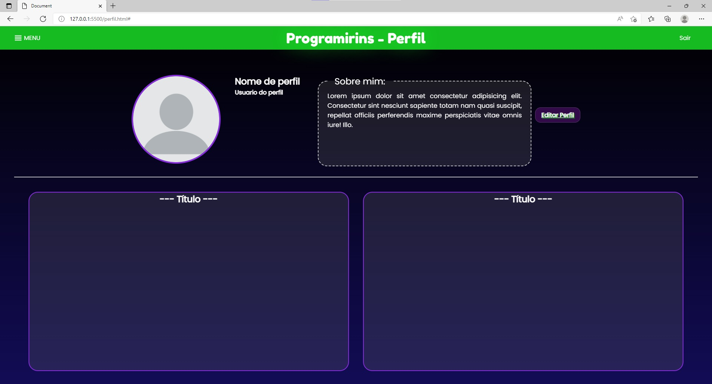

# Abril

## Índice
- Semana 8: Início da construção do perfil
- Semana 9: Checagem no progresso do projeto pelo supervisor
- Semana 10: Mudanças de imagens no projeto
- Semana 11: Construção do banco de dados do cadastro

## Semana 8 - dias 04 a 10

Iniciamos a construção da página "Perfil" do nosso projeto.

## Semana 9 - dias 11 a 17

Trabalhamos na construção dos primeiros exercícios e o apresentamos ao professor, que notou erros e falhas que precisamos corrigir.

## Semana 10 - dias 18 a 24

Substituímos as imagens com direitos autorais nas páginas já criadas.

## Semana 11 - dias 25 a 01

Construimos o banco de dados da parte do cadastro.

### [← Diário de Março](https://github.com/NatanPolsak/Programirins-by-VP/blob/main/diario/Marco.md) ou [Diário de Maio →](https://github.com/NatanPolsak/Programirins-by-VP/blob/main/diario/Maio.md)
