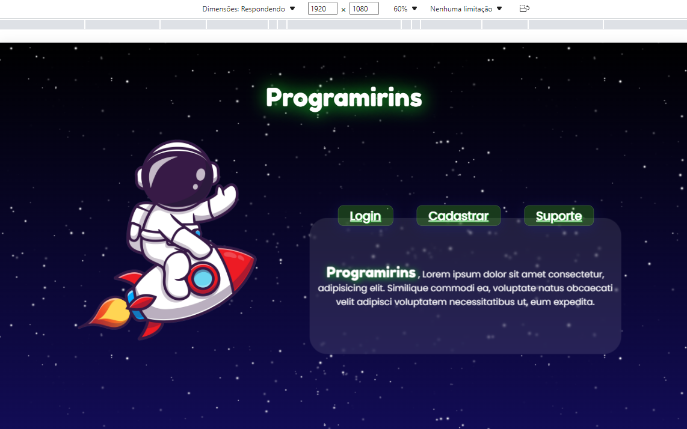
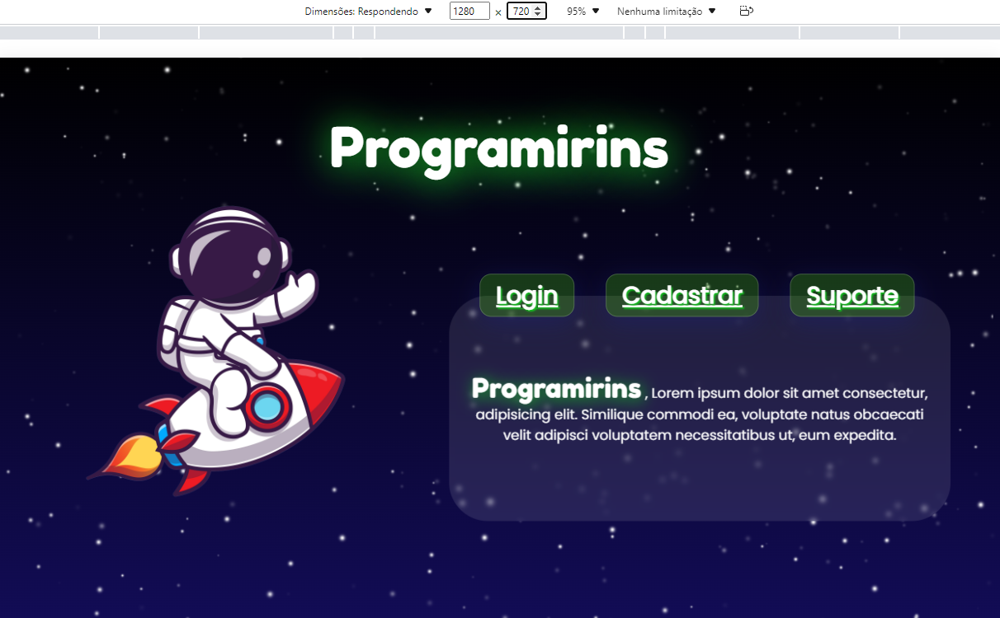

# Agosto

## Índice
* Semana 25
* Semana 26
* Semana 27 
* Semana 28 

## Semana 25 - dias 01 a 07
Refizemos o código da nossa página inicial, deixando-a adaptativa para mais resoluções (atualmente, para 1920x1080, 1366x768, 1280x720 e outras resoluções próximas)

## Semana 26 - dias 08 a 14

## Semana 27 - dias 15 a 21

## Semana 28 - dias 22 a 28

### [← Diário de Julho](https://github.com/NatanPolsak/Programirins-by-VP/blob/main/diario/Julho.md) ou [Diário de Setembro→](https://github.com/NatanPolsak/Programirins-by-VP/blob/main/diario/Setembro.md)
