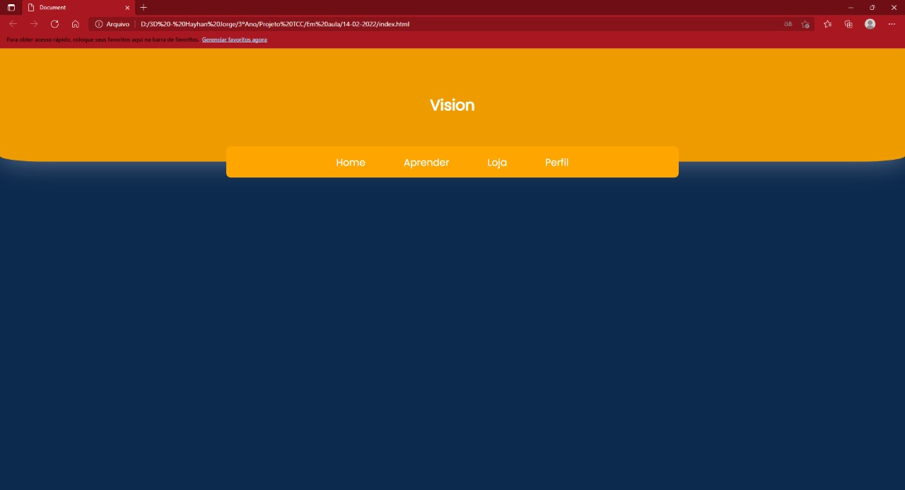
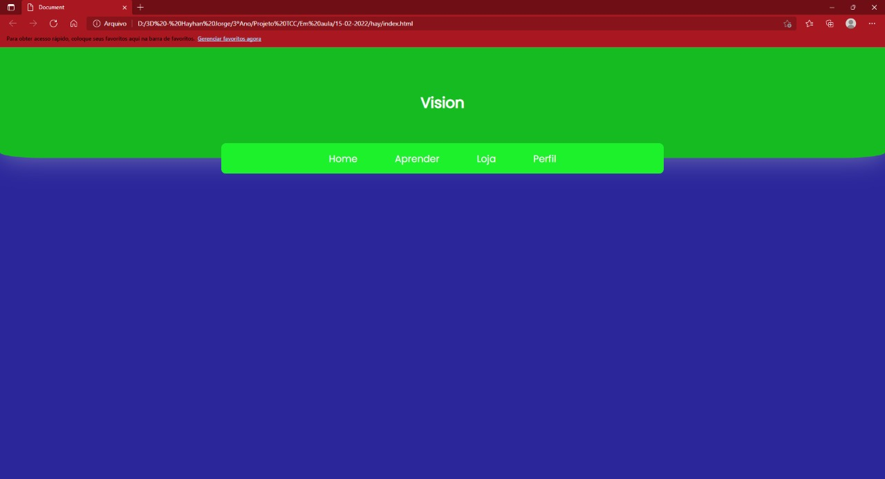
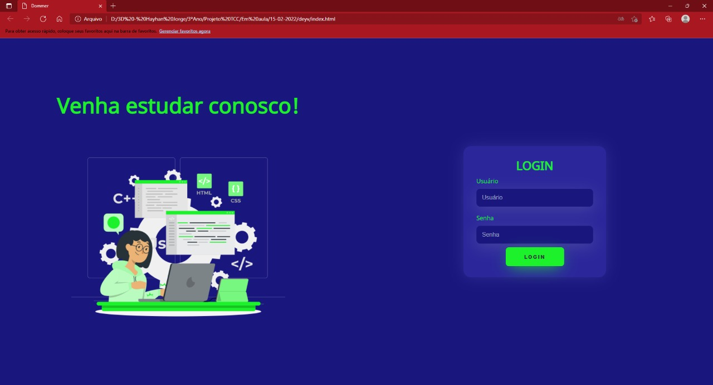
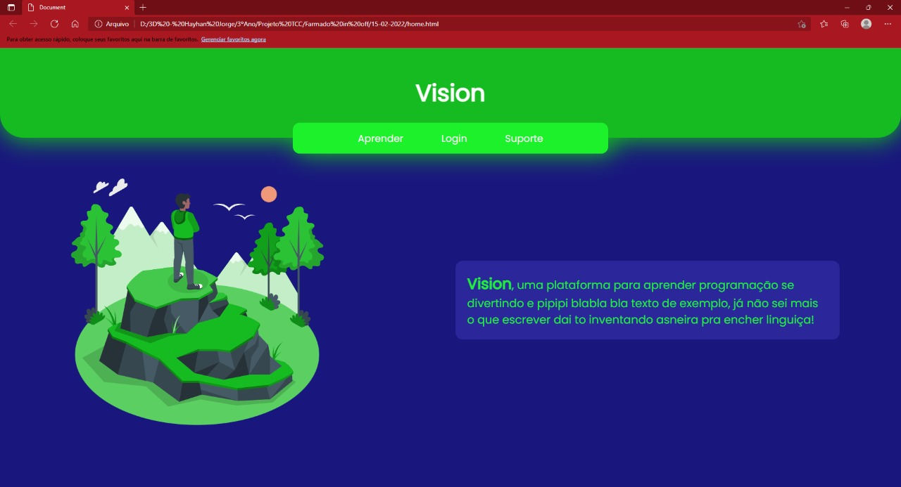
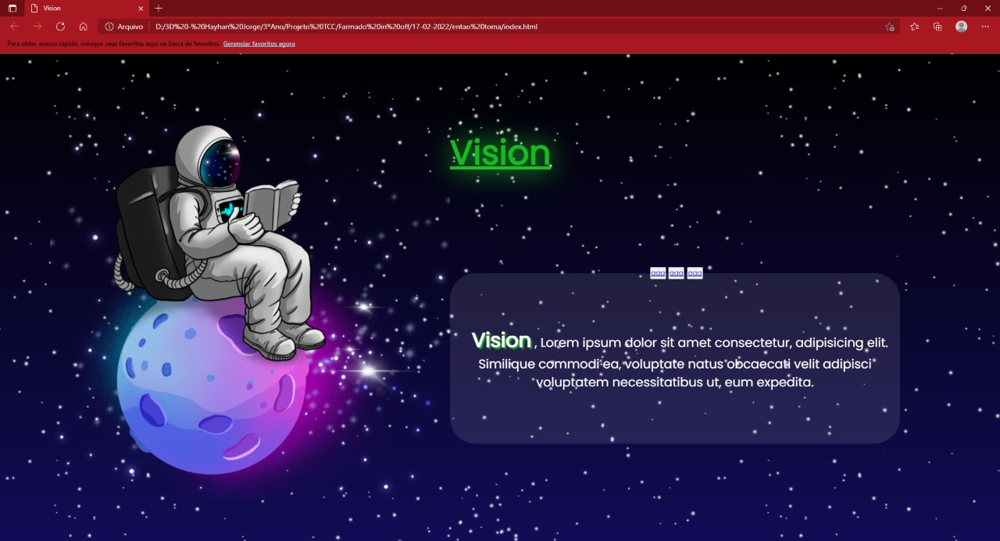

# Fevereiro

## Índice
- Semana 1: formação de grupos e discussão sobre o tema
- Semana 2: concretização do projeto e construção inicial
- Semana 3: reformulação do design e criação do logotipo
- Semana 4: ---
 
  ## Semana 1 - dias 13 a 20
Depois da formação dos grupos e a divisão de tarefas, houve uma discussão sobre o que seria o nosso TCC, as ideias não eram muito bem formadas ainda mas tinhamos certeza que deveria ser algo relacionado à educação.

Criamos algumas páginas como ideias iniciais:

Pesquisamos que a combinação de cores de verde e azul é mais atraente para jovens, que seria nosso público-alvo:

***

  ## Semana 2 - dias 21 a 26
  Formulamos uma melhor ideia do que nosso projeto seria, criariamos um site que ensinaria pessoas à programar, usando também um sistema de banco de dados para criar perfis. Vamos usar também [HTML](https://developer.mozilla.org/pt-BR/docs/Web/HTML) e [CSS](https://developer.mozilla.org/pt-BR/docs/Web/CSS) para a loading page, [JavaScript](https://developer.mozilla.org/pt-BR/docs/Web/JavaScript) pra refinar o front-end e construir o beck-end, [NodeJS](https://nodejs.org/en/about/) para auxiliar o [JavaScript](https://developer.mozilla.org/pt-BR/docs/Web/JavaScript) na construção do banco de dados, [Python](https://www.python.org/) e [Java](https://www.java.com/pt-BR/) para o desenvolvimento do software.
  Construção inicial da tematização do site.
  
  Fizemos a página de login:
  
  
  E também a página inicial:
  
  
***
## Semana 3 - Dias 27/02 a 04/03 
	
Mudamos totalmente a página inicial, com uma nova ideia, adicionando movimento à pagina:

Criação inicial da logotipo:

***
