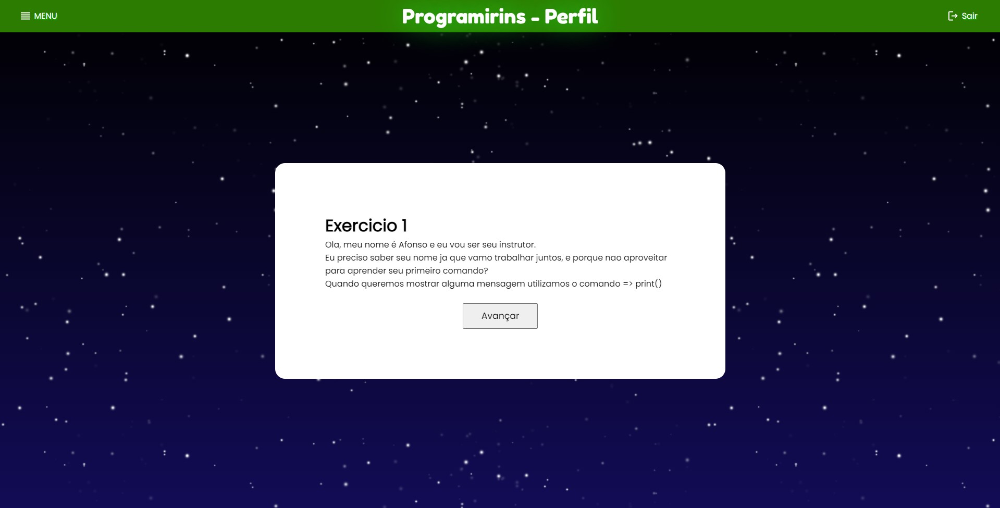

# Junho

## Índice
- Semana 16: Ajuste da página de seleção de exercícios
- Semana 17: Criação das primeiras páginas de exercícios
- Semana 18: Modificação do design das novas páginas
- Semana 19: Adição de pequenos detalhes nas páginas

## Semana 16 - dias 01 a 05
Modificamos o design da página de seleção de exercícios para ficar coerente com o restante do projeto.

## Semana 17 dias 06 a 12

Criamos as primeiras páginas de exercícios, adicionando também um sistema de verificação e progressão.

## Semana 18 - dias 13 a 19

Modificamos o design das novas páginas para ficarem coerentes com o restante do projeto e corrigimos alguns pontos apontados pelo professor.

## Semana 19 - dias 20 a 26

Adicionamos alguns pequenos detalhes em todas as páginas, como por exemplo, o efeito de borrão por trás dos painéis

### [← Diário de Maio](https://github.com/NatanPolsak/Programirins-by-VP/blob/main/diario/Maio.md) ou [Diário de Julho→](https://github.com/NatanPolsak/Programirins-by-VP/blob/main/diario/Julho.md)
