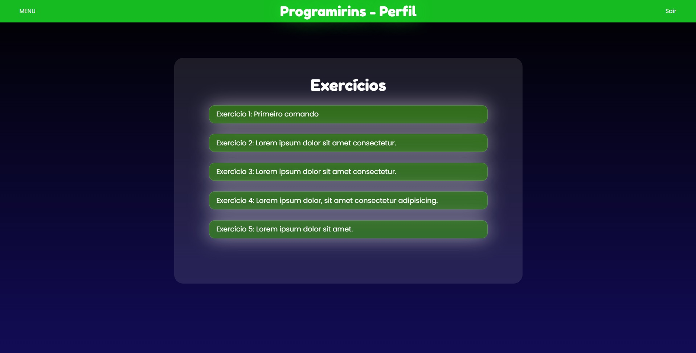
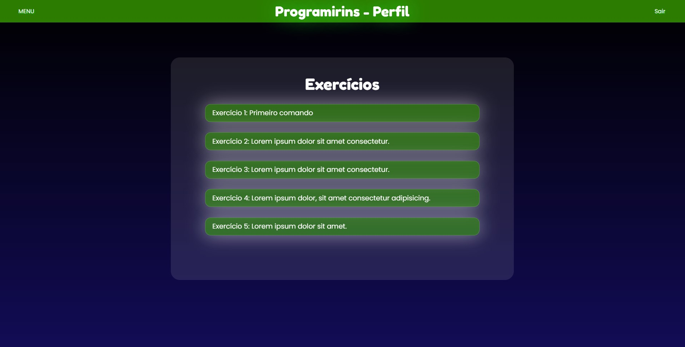

# Maio

## Índice
- Semana 12: Melhoria no banco de dados
- Semana 13: Apresentação técnica
- Semana 14: Construção da seleção de exercícios
- Semana 15:

## Semana 12 - dias 02 a 08

Melhoramos o banco de dados, adicionando criptografia aos dados (ainda estamos estudando como melhorá-lo ainda mais).

## Semana 13 dias 09 a 15

Apresentamos novamente o nosso projeto para o Professor. Recebemos orientações sobre o que melhorar.

## Semana 14 - dias 16 a 22

Criamos a página de seleção dos exerícios:

## Semana 15 - dias 23 a 29

Alteramos a cor do menu, tornando-a menos chamativa e extravagante

### [← Diário de Abril](https://github.com/NatanPolsak/Programirins-by-VP/blob/main/diario/Abril.md) ou [Diário de Junho →](https://github.com/NatanPolsak/Programirins-by-VP/blob/main/diario/Junho.md)
