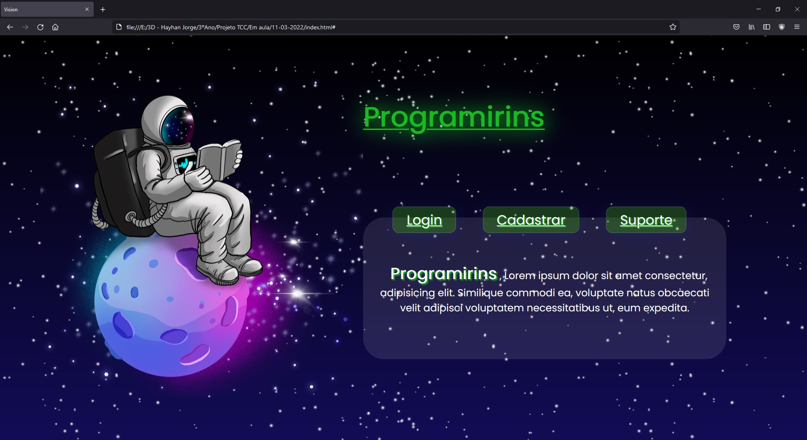
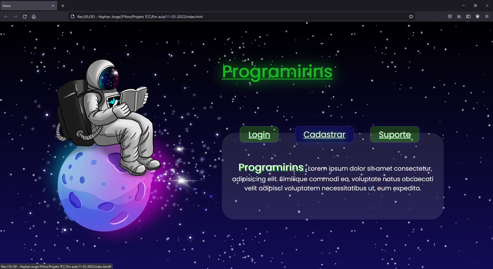
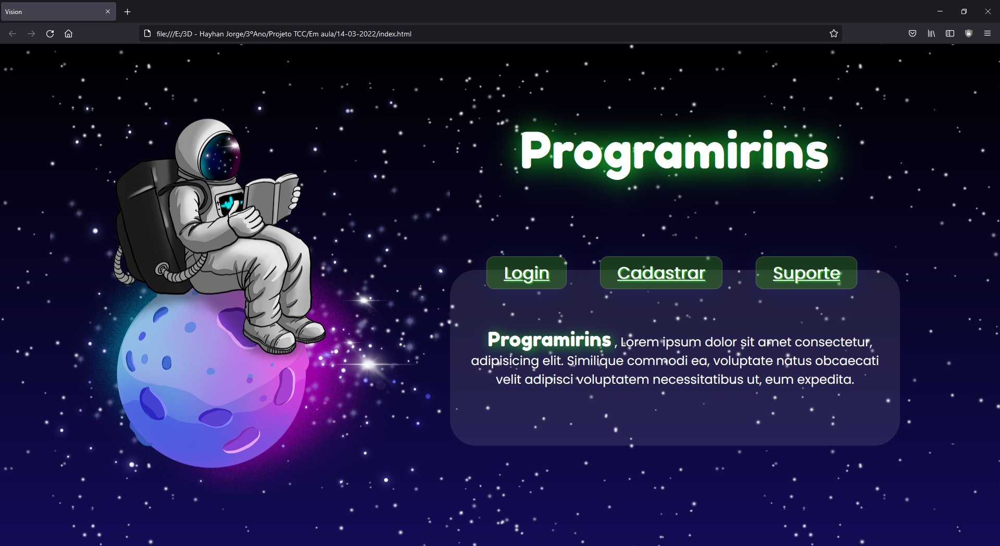
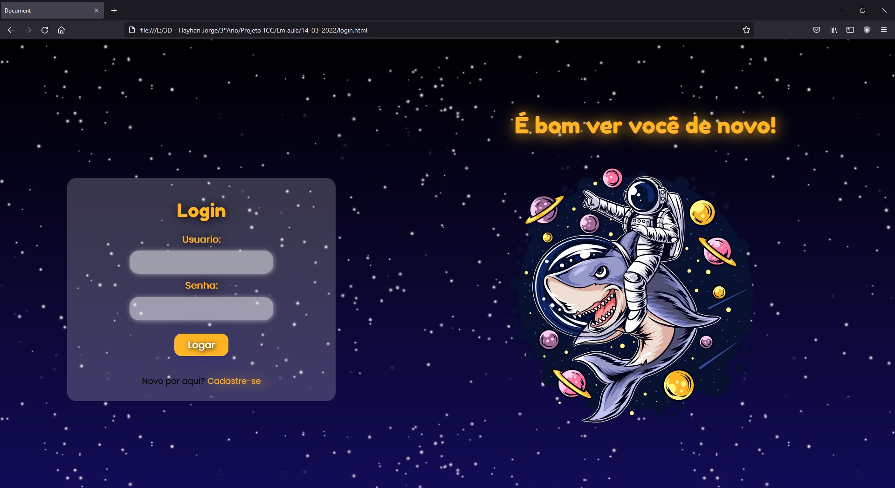
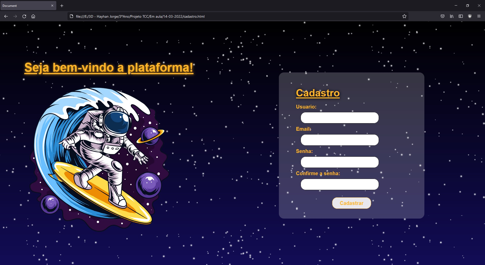
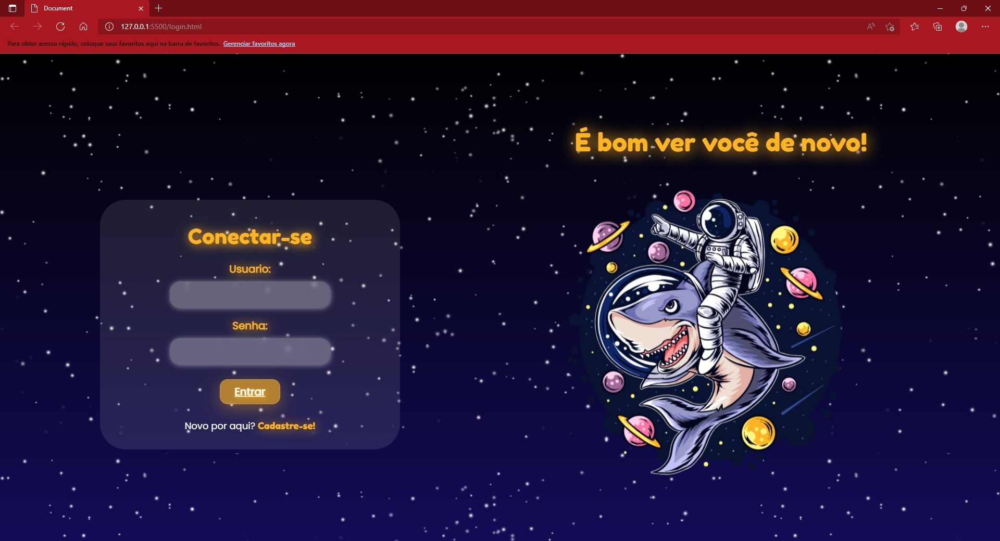
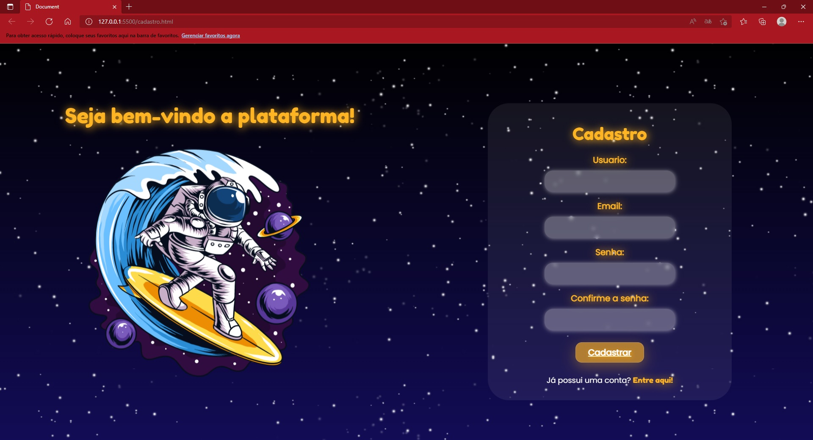

# Março

## Índice
- Semana 4: finalização da página inicial e declaração do nome do projeto
- Semana 5: mudança no design, conexão das páginas entre si e início da programação das atividades
- Semana 6: polimento das páginas
- Semana 7: análise geral

## Semana 4 - dias 07 a 13
Finalizamos a página inicial, adicionando botões e declarando um nome para o nosso projeto.

## Semana 5 - dias 14 a 20
Modificamos aspectos estéticos da página inicial, modificando o design do título.

Modificamos o design das páginas de login e cadastro para ficar coerente com a página inicial.

Conectamos os botões às respectivas páginas e iniciamos a pesquisa sobre como faremos a programação da parte das atividades.
- Conhecemos o [Jupyter](https://jupyter.org/) e o [REPL.](https://en.wikipedia.org/wiki/Read%E2%80%93eval%E2%80%93print_loop)

## Semana 6 - dias 21 a 27
Trabalhamos no acabamento das páginas de login e cadastro

## Semana 7 - dias 28 a 03
Os gerentes de documentação e técnico apresentaram o projeto para a sala e o professor. Nossa postura e evolução no projeto foram analisadas e recebemos o feedback do que era necessário mudar, como por exemplo averiguar se as imagens tinham direitos autorais assim como também diminuir o tempo de apresentação. Por fim fizemos uma análise geral do projeto e fizemos pequenas alterações na ideia, entretanto ainda precisamos analisar a questão dos direitos autorais.

--- 

### [← Diário de Fevereiro](https://github.com/NatanPolsak/Programirins-by-VP/blob/main/diario/Fevereiro.md) ou [Diário de Abril →](https://github.com/NatanPolsak/Programirins-by-VP/blob/main/diario/Abril.md)
