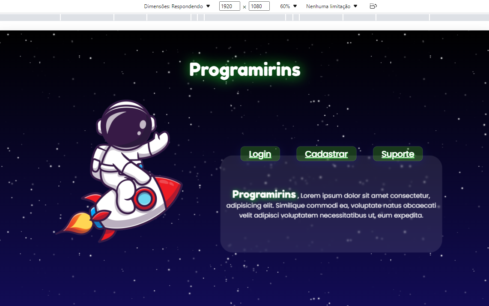

# Setembro

## Índice
* Semana 29 - atualizamos os códigos html para torná-los adaptativo
* Semana 30
* Semana 31 
* Semana 32 

## Semana 29 - dias 
Refizemos o código da nossa página inicial, deixando-a adaptativa para mais resoluções (atualmente, para 1920x1080, 1366x768, 1280x720 e outras resoluções próximas)

## Semana 30 - dias 
Refizemos o código, desta vez, da nossa página de cadastro, para torná-la adaptativa também

## Semana 31 - dias 

## Semana 32 - dias 

### [← Diário de Agosto](https://github.com/NatanPolsak/Programirins-by-VP/blob/main/diario/Agosto.md) ou [← Diário de Outubro](https://github.com/NatanPolsak/Programirins-by-VP/blob/main/diario/Outubro.md)
